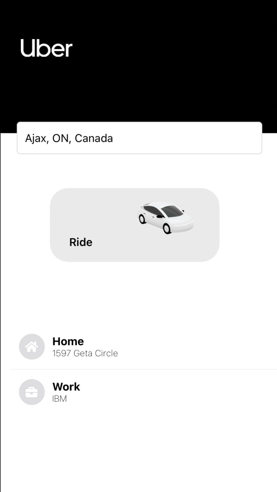
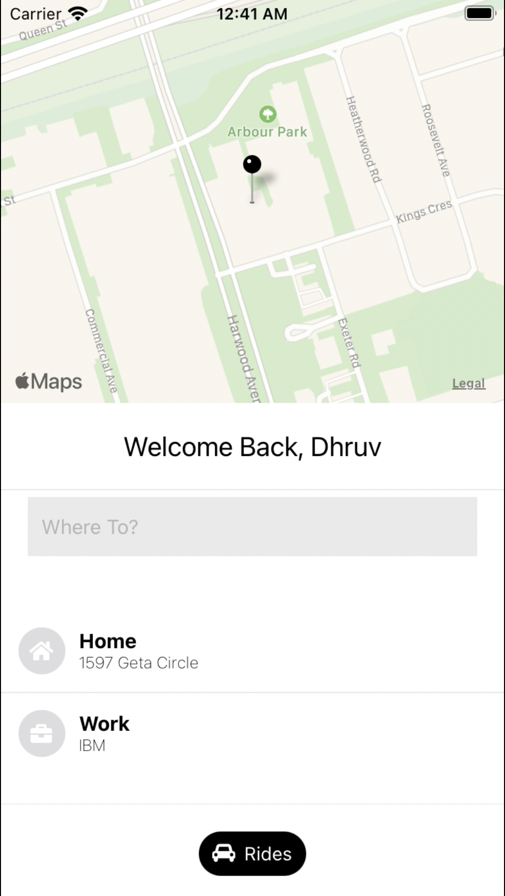
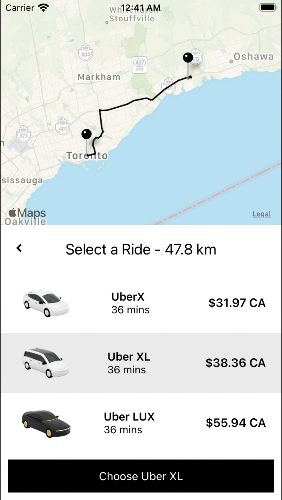
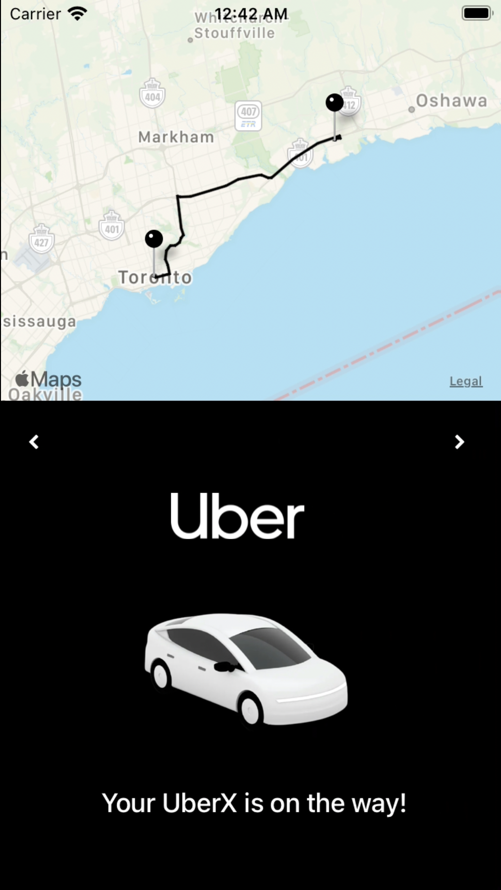

# Uber Clone

This app is a fully functional Uber Clone built with React-Native and Expo-CLI. It uses 3 Google API's: 'Places API', 'Directions API', and the 'Distance Matrix API'.

  
  
^ Click to see demo ^

  
  
  
  

